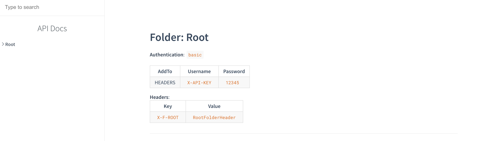
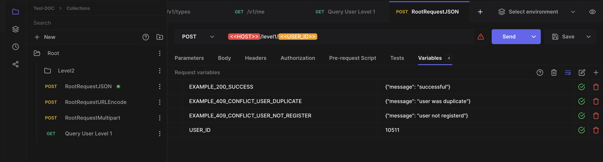
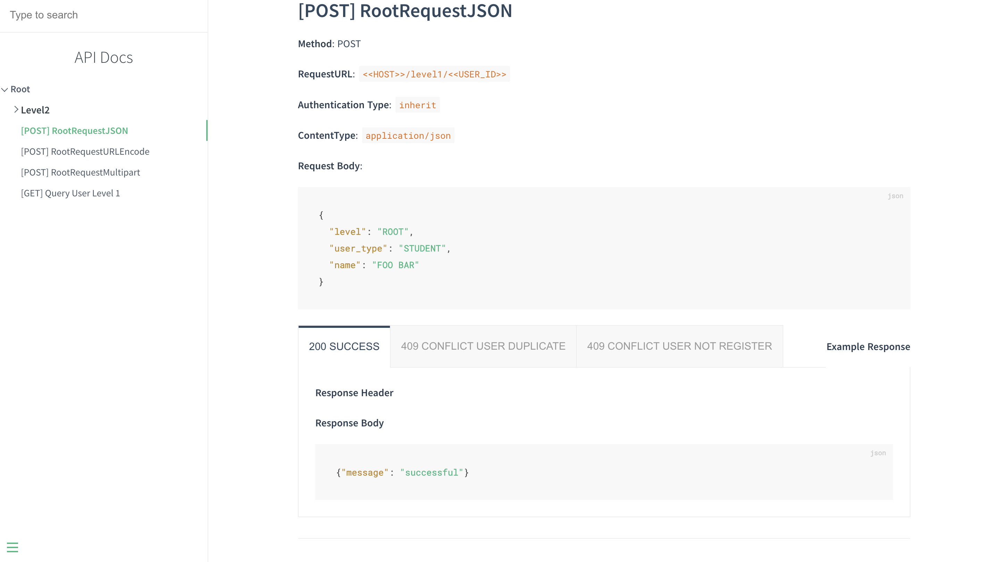
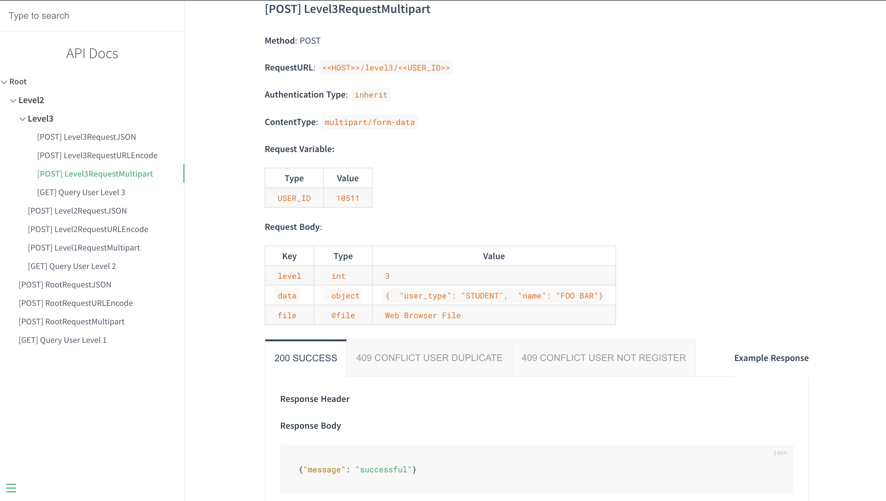

# HOPP-API-DOC
```quote
🔥 This service is a cronjob to process generate API Documentation Data From Hoppscotch with Tool Docsify Every 30 second
```

## Feature
- [✅] Auto Generate API Document `Every 30 second`
- [✅] Authenticate With Microsoft 
- [✅] Filter Team Collection By User
- [✅] Download API Document With Zip (can be serve with [Docsify CLI](https://docsify.js.org/#/) in your local)
- [✅] Example Body Response (format `EXAMPLE_$status_$name`)
- [✅] Support Request Body Content-Type (`applicatioon/json`, `multipart/form-data`, `application/x-www-form-urlencoded`)
- [✅] Request & Collection Support Header And Auth Type `Basic Auth`, `API KEY`, `Bearer Token`

- [✅] Import Hoppscotch Collection to generate Document 
- [ ] Authenticate With Google
- [ ] Authenticate With Github
- [ ] Request & Collection Support Auth Type `Oauth 2.0`

## Installing

Pull Images 
```shell
docker pull blackmocca/hopp-api-doc:v1.3.0-linux-amd64 
```

Run Images
```shell
docker run --name hopp-api-doc -v ${pwd}/docs:/usr/app/docs -p 3200:3000 --env-file=.env -d --restart unless-stopped blackmocca/hopp-api-doc:v1.3.0-linux-amd64 
```

## Demo    

- Demo Collection Property to Show Auth Type 


- Demo Input Example Response 
(format `EXAMPLE_$status_$name`)



- Demo Multipart FormData



## Environment
| Name       | Description    |
|-----------|------------|
| DATABASE_URL  | connection string Postgresql      |
| TIMER_SYNC_TEAM_COLLECTION  | define sync team collection in unit `second` |
| MICROSOFT_CLIENT_ID | Microsoft Oauth2 Client Id     |
| MICROSOFT_CLIENT_SECRET| Microsoft Oauth2 Client Secret  |
| MICROSOFT_CALLBACK_URL| Microsoft Oauth2 Valid Redirect `https://$yourdomain/v1/auth/microsoft/callback`|
| MICROSOFT_SCOPE| Microsoft Oauth2 Scope `user.read` Required Property email|
| MICROSOFT_TENANT| Microsoft Oauth2 Tanent |
